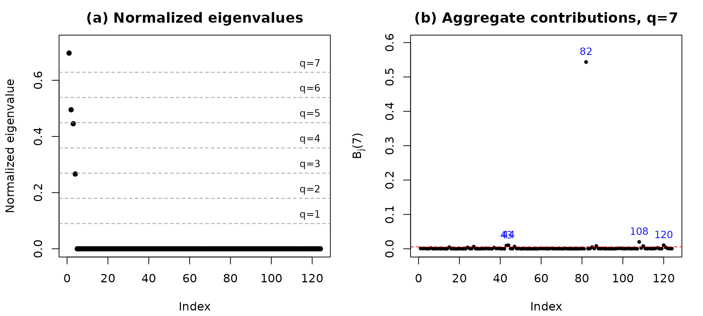
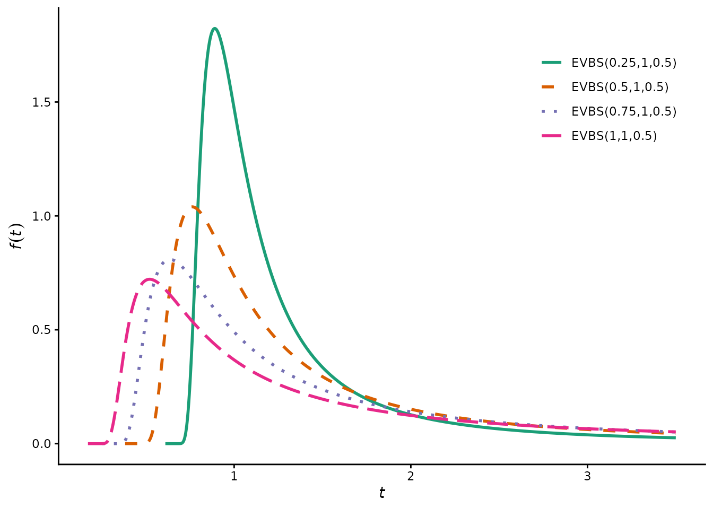

# Local influence diagnostics for the EVBS regression model

## Introduction

The **evbsreg** package implements local influence diagnostics for the
Extreme-Value Birnbaum–Saunders (EVBS) regression model. This vignette
walks through the complete workflow: fitting the model, diagnosing
influential observations, assessing model adequacy, and interpreting the
results, using the bundled Itajaí wind gust dataset.

``` r

library(evbsreg)
```

## The data

The `itajai` dataset contains 124 monthly maximum wind gust speeds and
the corresponding daily mean atmospheric pressure, recorded at INMET
station A-868 in Itajaí, Brazil, from July 2010 to October 2020.

``` r

data(itajai)
str(itajai)
#> 'data.frame':    124 obs. of  3 variables:
#>  $ month   : int  1 2 3 4 5 6 7 8 9 10 ...
#>  $ wind    : num  11.7 16.4 10.5 17.2 11.2 12.3 14 17.1 13.7 14.8 ...
#>  $ pressure: num  1020 1013 1015 1009 1008 ...
summary(itajai$wind)
#>    Min. 1st Qu.  Median    Mean 3rd Qu.    Max. 
#>    8.20   12.15   14.30   14.73   17.02   33.90
```

Observation 82 is the catastrophic event of 26 April 2017 (33.9 m/s).

## Fitting the model

The design matrix must include an intercept column. We model the
location of the log-EVBS distribution as a linear function of
atmospheric pressure.

``` r

X <- cbind(1, itajai$pressure)
fit <- evbsreg.fit(X, itajai$wind)

data.frame(
  Parameter = c("beta0", "beta1", "alpha", "gamma"),
  Estimate  = round(fit$coeff, 4),
  SE        = round(c(fit$stderrors, fit$stderroralpha, fit$stderrorgama), 4)
)
#>   Parameter Estimate     SE
#> 1     beta0  25.5148 3.3338
#> 2     beta1  -0.0227 0.0033
#> 3     alpha   0.1857 0.0127
#> 4     gamma  -0.1551 0.0472
```

Both regression coefficients are highly significant:

``` r

round(fit$pvalues, 4)
#> x1 x2 
#>  0  0
```

## Local influence diagnostics

The
[`cnc_diagnostics()`](https://raydonal.github.io/evbsreg/reference/cnc_diagnostics.md)
function computes the conformal normal curvature diagnostics from the
fitted object.

``` r

diag <- cnc_diagnostics(fit)

## Top four normalized eigenvalues
round(head(diag$eigenvalues_norm, 4), 5)
#> [1] 0.69678 0.49511 0.44547 0.26630

## Observations flagged at q = 7
which(diag$Bj[7, ] > diag$bq[7])
#> [1]  27  43  44  47  82  87 108 110 120
```

The two-panel diagnostic figure shows the normalized eigenvalues (left)
and the aggregate contributions (right). Observation 82 dominates.

``` r

plot_cnc(diag, q = 7)
```



## Deletion analysis

We refit the model without the flagged observation and measure the
relative change in each parameter.

``` r

fit82 <- evbsreg.fit(X[-82, ], itajai$wind[-82])
rc <- 100 * (fit82$coeff - fit$coeff) / abs(fit$coeff)
names(rc) <- c("beta0", "beta1", "alpha", "gamma")
round(rc, 2)
#>  beta0  beta1  alpha  gamma 
#>  -3.24   3.64   0.25 -73.67
```

The tail-shape parameter $`\gamma`$ changes by about $`-73.67\%`$, while
the regression coefficients and the scale parameter change by less than
$`4\%`$. The influence is therefore concentrated almost entirely on the
tail.

## Model adequacy

Randomized quantile residuals should be approximately standard normal
under a correct specification.

``` r

r <- rqrandomized(X, itajai$wind)
shapiro.test(r)
#> 
#>  Shapiro-Wilk normality test
#> 
#> data:  r
#> W = 0.98727, p-value = 0.3021
```

``` r

envelope_qq(X, itajai$wind, nrep = 100)
```


## Density shapes

The package also provides the density-plotting functions used to produce
Figures 1 and 2 of the paper.

``` r

plot_evbs_alpha()
```



## Reproducing the full study

Five standalone scripts reproduce every figure, table, and simulation in
the paper. After installation they are available via
[`system.file()`](https://rdrr.io/r/base/system.file.html):

``` r

# Density figures (Figures 1-2)
source(system.file("scripts/script_01_density_figures.R", package = "evbsreg"))

# Itajai application (Tables 1-3, Figures 3-6)
source(system.file("scripts/script_02_itajai_application.R", package = "evbsreg"))

# Monte Carlo (Tables 4-9); set m <- 500 inside for a quick check
source(system.file("scripts/script_03_simulation_scenario1.R", package = "evbsreg"))
source(system.file("scripts/script_04_simulation_scenario2.R", package = "evbsreg"))
source(system.file("scripts/script_05_simulation_scenario3.R", package = "evbsreg"))
```

## References

Ospina, R., Lima, J. I. C., Barros, M., and Macêdo, A. M. S. (2026).
*Local influence diagnostics for the extreme-value Birnbaum–Saunders
regression model: methodology, validation, and application to anomalous
wind gusts.* Submitted.
